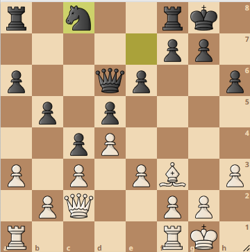

Man kan styra Lichess med fyra fotpedaler

[8BitDo](https://shop.8bitdo.com/products/8bitdo-keyboard-extensions?variant=44141790036145)

I ovanstående ställning kan vit välja mellan följande 34 drag:

||A|B|C|
|-|-|-|-|
|AA|a4|Dc1|Tfd1|
|AB|b3|Dd1|Tfe1|
|AC|b4|Dd2|Remi|
|AD|e4|Dd3|Uppg|
|BA|g3|De2||
|BB|g4|De4||
|BC|h4|Df5||
|BD|Ld1|Dg6||
|CA|Le2|Dh7||
|CB|Lg4|Ta2||
|CC|Lh5|Tab1||
|CD|Kh1|Tac1||
|DA|Kh2|Tad1||
|DB|Da4|Tae1||
|DC|Db1|Tfb1||
|DD|Db3|Tfc1||

A = Gul  
B = Grön  
C = Röd  
D = Blå  

Exempel: ABC => Tfe1

Efter inmatning av tre knappar måste man godkänna eller förkasta valt drag. Detta sker med B=grön eller C=röd.

Med två tryckningar klarar man 16 olika drag.  
Med tre 64.  
Med fyra 256.  