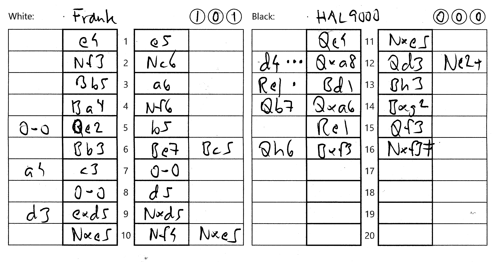

Det här schackprotokollet har två egenskaper:

1. Landskap. Det innebär att protokollet får bättre plats när schackbrädena är stora.
	* 105 millimeter räcker (halv A4 landskap).
	* Jämför med det vanliga 210 millimeter (A5 porträtt).

2. Det är avsett att kompletteras med en analys i de lediga kolumnerna

| |Category|loss in cp|Circle|
|:-:|:-:|:-:|:-:|
|*move* •••|Blunder|300-|Left|
|*move* ••|Mistake|100-300|Middle|
|*move* •|Inaccuracy|50-100|Right|
|*move*|Acceptable|20-50||
||OK|0-20||

Vid utskrift rekommenderas dubbelsidigt och standardmarginaler.

Om man har tillgång till en pappersskärare (eller är händig med saxen) kan man få ut två protokoll per A4.

[pdf](Panorama_1_3.pdf)

Qe2 är inte det bästa draget. 0-0 är bättre.  
Qxa8 är en blunder. d4 är bättre.  
Notera: [HAL 9000](https://www.youtube.com/watch?v=kYW7fnK2Cmc) spelade nästan perfekt.  

