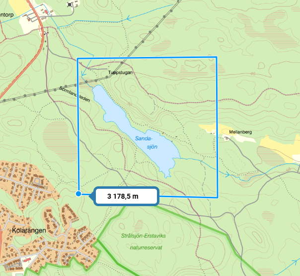

Detta är ett försök att kombinera schack med orientering och få schack att bli en bättre lagsport, som bygger på samarbete.

Man skapar ett virtuellt schackbräde, t ex i skogen och där det gärna får finnas hinder i form av vattendrag, berg och sjöar.

Varje schackruta är 100 x 100 meter. Hela brädet blir då 800 x 800 meter.

Spelarna startar appen och beger sig till sina överenskomna startpunkter.  
Då någon bestämt sig för ett drag, publicerar han dessa två rutor.  
Bara det egna laget kan se detta drag.  
Åtta rutor kan ligga på denna lista.  
Spelare som ligger nära till kan markera att de tänker hjälpa till.  
När både startruta och slutruta besökts, skickas draget till motståndaren och det plingar till i hans mobil.

Detta upprepas till man nått spelets slut.

# Optimering

Löparna hjälps åt att positionera sig på bästa sätt.  
Detta beror på var pjäserna står i pågående partier.  
Man kan se var spelarna i det egna laget befinner sig.  
Man ser dock bara sitt eget parti.  
Ibland väljer man ett svagare drag istället för ett starkare om löptiden på så sätt minimeras.  
Det kräver kännedom om terrängen och förmåga att läsa en karta, förutom att vara en god schackspelare.

# Löparnas uppgifter

En löpare kan markera sig för flera uppgifter samtidigt.  
Samtidigt kanske motståndaren gör ett drag och då måste man tänka ut ett svar också.

# Ett partis längd (enhet: rutsidor)

(Metod: manhattanavståndet. T ex ett springardrag blir 1+2=3 istf sqrt(5)=2.24)

|nr|drag|avstånd|
|-|-|-|
|1 |e2e4 |    2|
|2 |g1f3 |    2312 = 8|
|3 |d2d3 |     211 = 4|
|4 |e4xd5|    1111 = 4|
|5 |b1c3 |    2412 = 9|
|6 |c1d2 |    211  = 4|
|7 |d1c3 |    112  = 4|
|8 |f1e2 |    3211 = 7|
|9 |f1g1 |    111  = 3|
|10| h2h3|    111  = 3|
|11 |f3d2|    221  = 5|
|12 |d1e2|    111  = 3|
|13 |e2d1|    111  = 3|
|14 |f2f3|    211  = 4|
|15 |g1h1|    121  = 4|
|16 |d1e2|    411  = 6|
|17 |h1h2|    311  = 5|

I snitt blir det 78 rutsidor/17 = 4.6 rutsidor per drag.
Med rutsidan 100 meter blir det cirka 460 meter per drag.

Om löparen springer 5 minuter per km, tar löpandet ungefär 2.5 minuter per drag.  
Inkrementet bör alltså ligga på cirka 300 sek.

Om vi försöker uppskatta tidsåtgången för ett fyrmannalag, kan man räkna med att varje löpare rör sig 3 rutsidor, enkel väg.  
Fyra partier på 60 drag skulle innebära 60 * 3 * 100 meter = 18 km per spelare.  
I praktiken borde denna sträcka bli mindre pga samordningsmöjligheter.

# Parallella partier

Precis som i en lagmatch möter varje lagmedlem en spelare i andra laget.  
Samarbetet inom laget går ut på att man hjälps åt att utföra varandras drag.  
De drag som behöver utföras publiceras i en lista och man markerar att man tänker avverka dem.  
Det hindrar inte att någon annan kan hinna före.  
Partierna placeras så att varje spelare får ett väderstreck.  
I varje lag finns spelarna N, S, E och W. Som i bridge.

# Kartbild

Kan vara lämpligt att placera första matchen på en stor gräsplan, t ex Gärdet!  
Det här terrängavnittet kan tyckas lite extremt, men en varm sommardag kan det ge många tillfällen till bad.  
Sandasjön är 650 meter lång och dess bredd varierar mellan 50 och 100 meter.  
Vissa rutor kommer att hamna i vattnet, så det är lämpligt att ha ett vattentätt fodral till sin mobil.  
Självklart är grodfötter tillåtet, schack är ju en materialsport.

