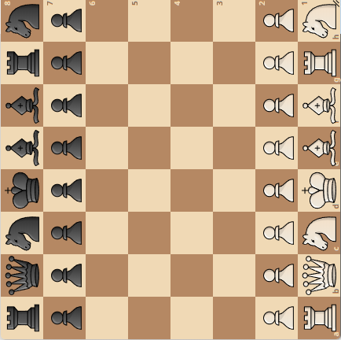

Detta är ett försök att kombinera schack med orientering och få schack att bli en bättre lagsport, som bygger på samarbete.

Man skapar ett virtuellt schackbräde, t ex i skogen och där det gärna får finnas naturliga hinder i form av vattendrag, berg och sjöar.

Varje schackruta är 100 x 100 meter. Hela brädet blir då 800 x 800 meter.

Spelarna startar appen och beger sig till sina överenskomna startpunkter.  
Då någon bestämt sig för ett drag, publicerar han detta som två uppdrag (startruta och slutruta).  
Bara det egna laget, med fyra medlemmar, kan se dessa uppdrag.  
Åtta uppdrag kan ligga på denna lista, fyra startrutor och fyra slutrutor.  
När både startruta och slutruta besökts, skickas draget till motståndaren och det plingar till i hans mobil.

Detta upprepas tills partiet spelats klart.

# Uppdrag

Fyra partier pågår samtidigt, precis som i en vanlig lagmatch.  
Dock utförs inte dragen förrän start och slutruta besökts boots on the ground.
Varje drag delas upp i två uppdrag: startruta och slutruta.  
Därefter fördelas de till en eller två kvadranter.  
Spelare C kan t ex bestämma sig för ett drag, t ex löparen a1-h8, som sedan utförs av spelare A och D, kanske parallellt.  
Då båda uppdragen utförts, skickas draget till motståndaren.  
Spelarna lämnar inte sina kvadranter, utan står kvar och väntar på nya uppdrag.

||a|b|c|d|e|f|g|h|
|-|-|-|-|-|-|-|-|-|
|8|C|C|C|C|D|D|D|D|
|7|C|C|C|C|D|D|D|D|
|6|C|C|C|C|D|D|D|D|
|5|C|C|C|C|D|D|D|D|
|4|A|A|A|A|B|B|B|B|
|3|A|A|A|A|B|B|B|B|
|2|A|A|A|A|B|B|B|B|
|1|A|A|A|A|B|B|B|B|

I början av partiet ovan, kan det tyckas som om spelare C och D inte får några uppdrag.  
Dock pågår fyra partier samtidigt, och dessa är roterade.  
Detta innebär att uppdragen kommer att fördelas någorlunda jämnt.  
Eftersom det handlar om schack, vet man inte var striderna kommer att äga rum.  

# Simulator

[Prova simulatorn!](https://christernilsson.github.io/2025/007-SchackOrientering/)  

Vid start samlas alla åtta deltagarna i brädets mittpunkt.  
Eftersom alla står i samma punkt, syns bara spelaren H.  
Därefter sätter man igång ett eller flera partier genom att klicka A, B, C, och/eller D.  

De fyra partierna är vända åt fyra olika väderstreck.  
Detta för att jämna ut geografiska orättvisor.

* A: Vit längst ner
* B: Vit till höger
* C: Vit högst upp
* D: Vit till vänster

Partierna är hämtade från Lichess.  
Därför är betänketiden noll sekunder.  
Tiderna man ser går åt till spelarnas förflyttning, en faktor 30 av normal tid.  
Varje spelare ansvarar för sin kvadrant av brädet, t ex har A abcd1234.  
Deltagarna antas börja på ett uppdrag så fort det dyker upp.  
Det kan slumpa sig så att en spelare får åtta uppdrag med en gång.  
I så fall börjar han med det närmaste, tar därefter nästa som är närmast, osv.  
Ibland står de redan på start- eller stopprutan och då markeras uppdraget som klart.  
Annars börjar de förflytta sig mot den ruta som är närmast, av alla uppdrag.  
Dyker det upp ett nytt uppdrag, som är närmare än det pågående, byter man automatiskt till det.  
Detta är en primitiv algoritm för att approximativt hitta en bra lösning.  
(Den perfekta lösningen kan vara svår att finna, man har ju inte alla dragen i verkligheten)  

Det egna lagets deltagare är markerade med A-D, motståndarna E-H.  
Den ruta man ska gå till är markerad med ett streck.  
Andra drag är markerade med röda punkter.  
Start och slutruta är hopkopplade med ett streck.  

### Optimeringsmöjlighet
Man kan se var spelarna i det egna laget befinner sig.  
Man ser dock bara sitt eget parti.  
Vid tidsnöd kan man välja ett svagare drag istället för ett starkare om löptiden på så sätt minimeras.  

### Deltagarens uppgifter

1. Sköta sitt eget parti.
2. Utföra alla tilldelade uppdrag.

### Parallella partier

Precis som i en lagmatch möter varje lagmedlem en spelare i andra laget.  
Samarbetet inom laget går ut på att man hjälps åt att utföra varandras drag.  
De drag som behöver utföras fördelas på spelarnas kvadranter. 
Partierna placeras så att varje spelare får ett väderstreck.  
I varje lag finns spelarna N, S, E och W. Som i bridge.

De fyra brädena är orienterade som nedan.  
Tänk er brädena staplade på höjden.  
N:g1 delar ruta med W:h7, E:b8 samt S:a2.  
*Det behöver inte vara Fischer 960*  
En spelare ser bara sitt eget bräde (rättvänt), och han ser dessutom var alla lagkamrater befinner sig.  
|||
|-|-|
|N |W |
|E |S |

### Kartbild

*Det kan vara lämpligt att placera första matchen på en stor gräsplan, t ex Gärdet!*  

Det här [terrängavsnittet](https://minkarta.lantmateriet.se/plats/3006/v2.0/?e=681858&n=6575132&z=12&mapprofile=karta&layers=%5B%5B%223%22%5D%2C%5B%221%22%5D%5D) kan tyckas lite extremt, men en varm sommardag kan det ge många tillfällen till bad.  
Sandasjön är 650 meter lång och dess bredd varierar mellan 50 och 100 meter.  
Vissa rutor kommer att hamna i vattnet, så det är lämpligt att ha ett vattentätt fodral till sin mobil.  
*Självklart är grodfötter tillåtet, schack är ju en materialsport.*

Fundering: Bör man rockera kort eller långt med denna topografi?

### Appen

Deltagarna behöver varsin mobil och varsin kompass.  

Appen visar ett schackbräde, samt en översiktsbild över var övriga lagmedlemmar befinner sig.  
Man kan växla mellan dessa två bilder.  
Schackdrag utförs genom att klicka på start och slutrutorna.  
Uppdragen ges via röstkommandon, medtag hörlurar.  

* Hörs en manlig röst säga "ett åtta" innebär det att gå i riktning 180, dvs rakt söderut. Ställ in kompassen på 180.  
* Då man kommit ur kurs, kommer en ny bäring. Ställ in kompassen och fortsätt.  
* Hörs en kvinnlig röst "nittio" innebär det att man har 90 meter till målet. Denna avstånd minskar förhoppnigsvis, tills man hör enstaka meter i slutet.  

Då man kommit inom två meter från målet anses uppdraget slutfört och man får ett nytt uppdrag automatiskt. Annars står man kvar och väntar.  
