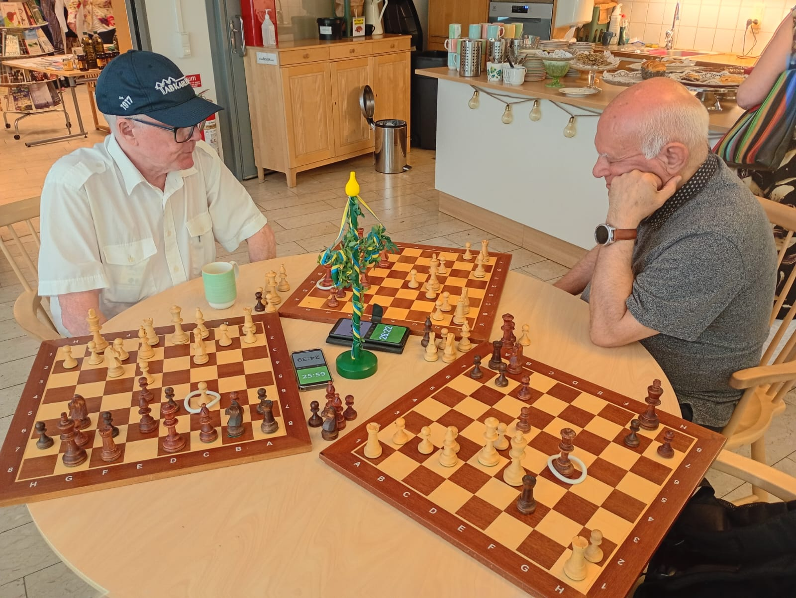

RIO 2025. Christer Nilsson möter Abbas Razavi. Tredje spelaren har fått ett telefonsamtal.
Christer idlar, vilket man kan se på de vita ringarna, men även på klockorna.

Denna turneringsvariant bygger på tre trekanter, benämnda A, B och C.

Antalet spelare ska vara exakt nio.

En trekant består av tre spelare med tre bräden som spelar tre partier samtidigt.

T ex har Abbas vit mot Christer och svart mot Beata. Samtidigt spelar Beata svart mot Christer.

Helst dubbelrond. Dubbelrond åstadkommes genom att två spelare byter plats.

Trevligast är att spela vid ett runt bord, cirka 120 cm i diameter. Klockorna placeras i mitten.

Man spelar fyra ronder och möter då alla spelare en gång.

```
A, B och C är tre bord.

Spelare Ronder
        1 2 3 4
1       A A A A
2       A B B B
3       A C C C
4       B C B A
5       B A C B
6       B B A C
7       C C A B
8       C B C A
9       C A B C
```

T ex spelar spelarna 1, 2 och 3 på bord A i första ronden

Lämpligen ställer man de tre klockorna på 90+30.
Om man vill spela dubbelrondigt, sänk till 45+15. 

Då man spelar simultan, kan det vara praktiskt att markera senaste draget med en gummiring.  
typ 55 x 6 mm, vit, Biltema. Då slipper man fråga vilket drag motståndaren gjort.
* Då man utfört draget e4, läggs ringen på e4. 
* Efter d5 läggs ringen på d5. 
* Efter e4xd5 behöver ringen ej flyttas.

Varje trekant behöver
* tre spelare
* tre bräden med pjäser
* tre klockor
* tre ringar
* tre stolar
* ett runt bord, diameter cirka 120 cm

